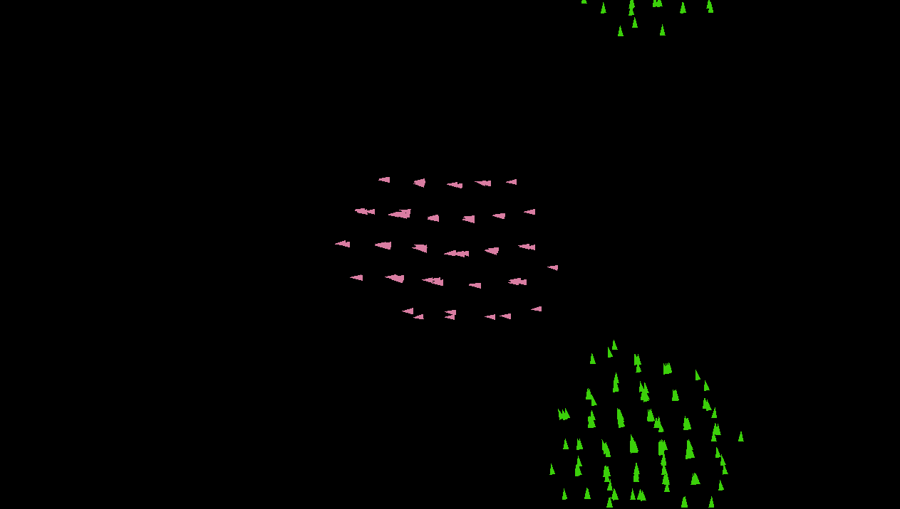

# Boids Simulation
This project simulates the behaviour of boids in a 2D-space using the equations of the model created by **Craig Reynolds (1986)**. This simple project is an example of how local rules can give rise to a complex collective behaviour.

---

## Rules

The boids in the simulation influence each other positions and velocities according to the following rules:
* **Separation**: boids closer than a distance ds separate.
```math
\vec{v}_1 = -s\sum_{j\ne i}(\vec{x}_{b_j}-\vec{x}_{b_i})\quad \text{when}\quad \left| \vec{x}_{b_i}-\vec{x}_{b_j}\right| \lt {d}_s
``` 
* **Allignment**:  boids closer than a distance d allign in the same direction.
```math
\vec{v}_2 = a(\frac{1}{n-1}\sum_{j\ne i}\vec{v}_{b_j} - \vec{v}_{b_i})\quad \text{when}\quad \left| \vec{x}_{b_i}-\vec{x}_{b_j}\right| \lt {d}
```
* **Cohesion**:  boids closer than a distance d tend to stick together.
```math
\vec{v}_3 = c(\vec{x}_{c}-\vec{x}_{b_i})\quad \text{when}\quad \left| \vec{x}_{b_i}-\vec{x}_{b_j}\right| \lt {d}
```
with
```math
\vec{x}_{c} = \frac{1}{n-1}\sum_{j\ne i}\vec{x}_{b_j}
```
where s, a and c are the coefficients expressing the intensity of a rule.

---

## Guide to intallation

This project was developed using SFML 2.5.1, so make sure you have a compatible version installed.

To clone the project:
```bash
git clone https://github.com/Elyan707/Boids.git
```

To compile and run the project:
```bash
cmake -S . -B build -DCMAKE_BUILD_TYPE=Debug 
cmake --build build 
./build/boid 
```

## Input
First of all insert the initial parameters using the command **g**. The following is a suggestion:
* N = 100;
* s = 0,5;
* a = 0,5;
* c = 0,5;
* d = 300;
* ds = 50.

You can generate and observe more than a single flock, but for now different flocks don't interact.

With the command **f** you can view the flock in an sfml window.
This is an example of two flocks after a certain amount of time:



If in the CMake file in the line 22 you change main-sfml.cpp with main.cpp and then repeat the process to run the programm, now among the possible commands there will be **s** and **h** to generate some statistics (about velocity and position) and view the relative histograms for a flock in a finite amount of time.


